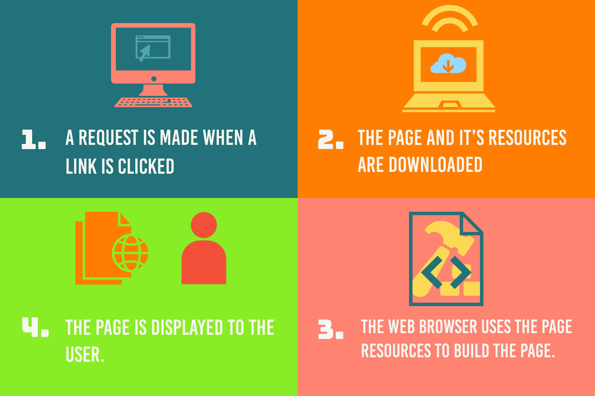

# 1. Introduction

## Intro to HTML

2 hours

## Lesson objectives

* Understand how internet works and browers work
* First experience of making a web page
* Understand role of html/js/css

## Course materials

* Slide deck by Emmanuel
* Infographic How internet works
* Infographic on How browser works
* Html example file can create





## Teacher instruction

_Class Ex_ - As the teacher explain how to perform a task. Then each student individually performs the task on their machine. Once 80% of class has completed task move on.

### Lecture \(30 minutes\):

* Explain how the internet and browser works. _Make sure explain browser is chrome/firefox/Safari..._




* Explain Html and demonstrate a html page

  * What does HTML stand for? _Ask class  Answer: Hypertext Markup Language: Mark up language so way of describing text and how it should look._
  * _Explain may ways of creating a website: e.g. can use wix or wordpress which are more drag and drop. But all create HTML, js, and css. And this is what brower reads and unpacks to display info._
  * _Explain at moment html file browser just unpacking a file like word unpacks a word document. And that file is local. Later file will be online and browser will go to a site to get file \(as in diagram\)_
  * Explain opening and closing tags. Closing tag lets the computer know when something ends.
  * _Explain tag is &lt;...&gt;_
  * Go through some key tags: Like:

    ```markup
    <html>, <body>, <head>, <p>, <h1>, <title>, <div>

    <ul>, <ol>, <li>
    ```

    * Title: shows up on the tab header of the page
    * Div: grouping element. Will cover in more depth later in the course but this is one of the most versatile element in html
    * List element. _Explain difference between &lt;ul&gt; and &lt;ol&gt;._

  * Page layout. 

  ```markup
  <html>
  <head>
  <title>This is a title</title>
  </head>
  <body>
  <div>
      <p>Hello world!</p>
  </div>
  </body>
  </html>
  ```

* _Class Ex:_ open a webpage. View source \(right click&gt;View Page Source\) and get them to spot the tags went through
* Visual learning watch this Video:

[Viewpure link](http://www.viewpure.com/WTdLcipEqsc?start=0&end=0). Prefer over youtube for educational purposes



### Step by step guided excerise \(1 hr\):

_Class Ex_: Walk through \(already set up\) VS code. Then class to write the code teacher wrote, then add an extra tag of their choosing.

* Explain CSS and demonstrate how css styling can change the background colour / text colour  

  _Class Ex_ Everyone in class do that

* Explain Javascript:
  * Demonstrate how to open debug console in chrome
  * Write code in chrome console \(alert\)
  * Write a js file and link to html  
    Will discuss more about js tomorrow.

    _Class Ex_: Everyone in class do above steps
* Live server:

  _Class Ex_ Install liveserver plugin and demonstrate how to use to display live updating data. \(By e.g. changing the colour of a page\)

  [Live Server VS extension](https://marketplace.visualstudio.com/items?itemName=ritwickdey.LiveServer). Instructions there for how to start it up

### Class Experiment \(30 minutes\):

_Class Ex_: Recreate the webpage. But each student to add own individual twist from what learnt

## Teacher Recommendations:

Make lesson interactive for example:

* Asking them if know internet works
* Get them to pick the background colour of page 

#### What worked well in the past:

The test student went bit over top and did a website with pics and sound. Was relatively easy homework

#### What hasn't worked well in the past

